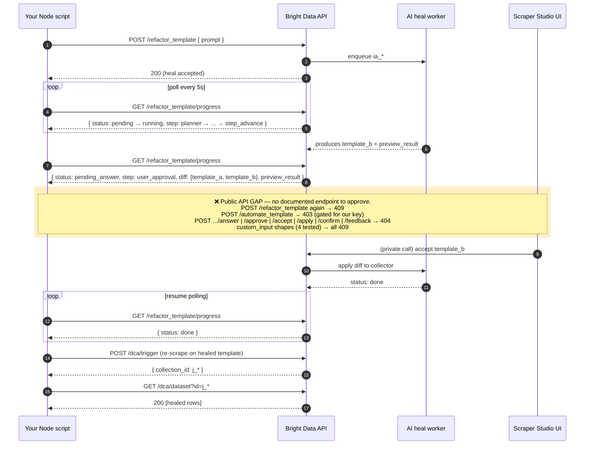

# Bright Data Scraper Studio API — End-to-End Flow

Synthesis of all 13 [Scraper Studio API](https://docs.brightdata.com/api-reference/scraper-studio-api/Getting_started_wtih_the_API) doc pages into one picture, with the `pending_answer` gap we discovered while building this demo highlighted.

## ID legend

These prefixes show up in every endpoint — useful to keep straight.

| Prefix | What | Issued by |
|---|---|---|
| `c_*` | Collector / scraper template | `POST /dca/collector` |
| `t_*` | Template version (inside a collector) | server-generated |
| `p_*` | Parser slot (inside a template) | server-generated |
| `ia_*` | **AI job** — used by both AI Flow *and* Self-Healing | `POST .../automate_template` or `.../refactor_template` |
| `j_*` | Batch collection ID | `POST /dca/trigger` |
| `z*`  | Real-time response ID | `POST /dca/trigger_immediate` or `202` from `/dca/crawl` |

## Full ecosystem

```mermaid
flowchart TB
  subgraph S["1️⃣  SETUP"]
    A[POST /dca/collector<br/>Create Scraper Template<br/>→ c_*]
  end

  subgraph B["2️⃣  BUILD CODE — Workflow 1 (AI Flow)"]
    direction TB
    B1[POST /dca/collectors/c_*/automate_template<br/>{ description, urls&#x5B;0..1&#x5D; }<br/>→ { id: ia_*, queued }]
    B2[GET /dca/collectors/c_*/automate_template/progress<br/>poll until status:&quot;done&quot;]
    B1 --> B2
  end

  subgraph H["3️⃣  UPDATE CODE — Workflow 2 (Self-Healing)"]
    direction TB
    H1[POST /dca/collectors/c_*/refactor_template<br/>{ prompt, custom_input }<br/>→ heal job ia_*]
    H2[GET /dca/collectors/c_*/refactor_template/progress<br/>status: pending → running → ?]
    H3{status?}
    H4[⚠️ pending_answer<br/>step: user_approval<br/>+ diff + preview_result]
    H5[approve in Scraper Studio UI<br/>⚠️ no public API endpoint]
    H1 --> H2 --> H3
    H3 -->|done| READY
    H3 -->|pending_answer| H4 --> H5 --> H2
  end

  READY((scraper code ready))

  subgraph R["4️⃣  RUN — pick one"]
    direction LR
    R1[POST /dca/trigger?collector=c_*&queue_next=1<br/>BATCH async<br/>body: array of {url}<br/>→ { collection_id: j_*, start_eta }]
    R2[POST /dca/trigger_immediate?collector=c_*<br/>REALTIME async<br/>body: {url}<br/>→ { response_id: z* }]
    R3[POST /dca/crawl?collector=c_*&timeout=50s<br/>REALTIME sync<br/>body: {url}<br/>→ rows inline OR 202 + z*]
  end

  subgraph D["5️⃣  RECEIVE DATA"]
    direction LR
    D1[GET /dca/dataset?id=j_*<br/>202 {status:&quot;building&quot;} until ready<br/>200 &#x5B;rows&#x5D; when done]
    D2[GET /dca/get_result?response_id=z*<br/>→ rows]
    D3[Push delivery: webhook / S3 / GCS / SFTP / Azure / Email / Ali OSS<br/>configured in collector.deliver]
  end

  subgraph I["🔍  INSPECT"]
    I1[GET /dca/log/&#x7B;job_id&#x7D;<br/>{ Status, Success_rate, Lines, Pages, Job_time, ... }]
  end

  A --> B1
  A --> H1
  B2 -->|status:done| READY
  READY --> R1 & R2 & R3
  R1 --> D1
  R1 -.->|or via collector deliver| D3
  R2 --> D2
  R2 -.->|or via collector deliver| D3
  R3 -.->|on 202 timeout| D2
  D1 --> I1
  D2 --> I1
```

## Zoom: Workflow 2 (Self-Healing lifecycle)

The full sequence including the `pending_answer` / `user_approval` gap that this demo exits on with code `3`.



## Flat endpoint reference

All endpoints are under `https://api.brightdata.com` and require `Authorization: Bearer <api_key>`.

| Phase | Method | Path | Body / Params | Returns |
|---|---|---|---|---|
| Setup | `POST` | `/dca/collector` | `{ name, deliver: { type, ... } }` | full collector incl. `id: c_*` |
| AI Flow | `POST` | `/dca/collectors/{c_*}/automate_template` | `{ description (≤500), urls (≤1) }` | `{ id: ia_*, queued }` |
| AI Flow | `GET`  | `/dca/collectors/{c_*}/automate_template/progress` | — | `{ step, completed_steps, status: "done" }` |
| Self-Heal | `POST` | `/dca/collectors/{c_*}/refactor_template` | `{ prompt (≤1000), custom_input?: object[] }` | (200) heal accepted |
| Self-Heal | `GET`  | `/dca/collectors/{c_*}/refactor_template/progress` | — | `{ id: ia_*, status, step, completed_steps, diff?, preview_result? }` |
| Run | `POST` | `/dca/trigger?collector={c_*}&queue_next=1` | `[{url}, ...]` | `{ collection_id: j_*, start_eta }` |
| Run | `POST` | `/dca/trigger_immediate?collector={c_*}` | `{url}` | `{ response_id: z* }` |
| Run | `POST` | `/dca/crawl?collector={c_*}&timeout=50s` | `{url}` (single object, **not** array) | rows inline; OR `202 { error, message, response_id }` on timeout |
| Receive | `GET` | `/dca/dataset?id={j_*}` | — | `202 {status:"building", ...}` until ready, then `200 [rows]` |
| Receive | `GET` | `/dca/get_result?response_id={z*}` | — | `200 [rows]` |
| Inspect | `GET` | `/dca/log/{job_id}` | — | `{ Id, Status, Collector, Template, Lines, Fails, Success_rate, Job_time, ... }` |

## Five things that were not obvious from any single doc page

1. **AI Flow and Self-Healing share the `ia_*` job-ID namespace** and almost certainly the same worker pool. So `pending_answer` is likely a state the AI Flow can also reach — the docs just don't show it.
2. **The `pending_answer` / `user_approval` state is undocumented** — neither term appears anywhere in the 13 doc pages. The progress endpoint's response schema is left as just `description: "Self-healing job progress status"` with no example, no fields.
3. **`/dca/crawl` is the odd one out** — it's the only "trigger" that returns rows inline (with a 25–50 s ceiling) instead of an ID-then-poll pattern. It also requires a single `{url}` object, not an array.
4. **Result endpoints are split by job kind:** `/dca/dataset?id=j_*` for batches, `/dca/get_result?response_id=z*` for realtime. The two are not interchangeable.
5. **Push delivery is collector-level, not call-level.** The `deliver` block on `POST /dca/collector` (webhook / S3 / GCS / SFTP / Azure / Email / Ali OSS / GCS PubSub) decides whether results show up in your storage automatically *in addition to* what the trigger endpoint returns.
